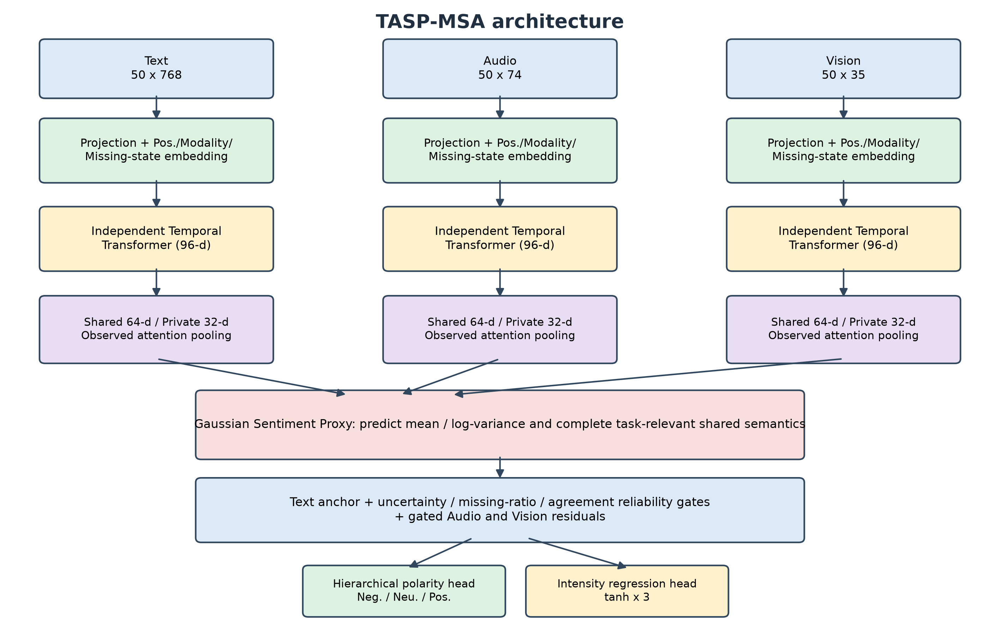

# TASP-MSA

TASP-MSA（Text-Anchored Sentiment Proxy for Multimodal Sentiment Analysis）是一个面向
**连续局部模态缺失**场景的轻量级多模态情感预测模型。模型同时输出三分类情感极性
（Negative / Neutral / Positive）和区间 `[-3, 3]` 内的连续情感强度。

本仓库只保留最终方法的源码与复现说明，不包含旧版本代码、官方数据、训练日志和中间
checkpoint。模型共含 **560,177** 个可训练参数，适合当前中小规模 CMU-MOSEI 子集。



## 方法概览

TASP-MSA 的主要组成如下：

1. 将文本、语音和视觉特征分别投影到统一隐藏空间，并叠加位置、模态和缺失状态编码；
2. 使用三个参数独立的时序 Transformer 建模模态内上下文；
3. 将编码结果分解为 64 维共享情感语义与 32 维模态私有表示；
4. 使用高斯情感语义代理网络在共享空间估计缺失语义的均值与对数方差；
5. 以补全后的文本共享语义为锚点，将语音和视觉作为受缺失率、代理不确定性及跨模态
   一致性共同控制的可靠性残差；
6. 通过层次分类头和回归头分别输出情感极性与强度。

训练阶段对同一原始样本构造 Full、Single Missing 和 Double Missing 三种视图，并联合使用
分类、回归、语义代理、跨视图一致性、表示一致性、私有模态判别、正交和共享对齐损失。

## 主要结果

模型仅在 Attachment 2 的 `train` 上学习参数，由 `valid` 选择 checkpoint；以下 `test`
结果在模型冻结后计算，未用于模型选择。

| Split / condition | Accuracy | Macro-F1 | MAE | Pearson |
|---|---:|---:|---:|---:|
| Valid, full input | 0.6442 | 0.6013 | 0.6095 | 0.6425 |
| Test, full input | **0.6713** | **0.6105** | **0.6371** | **0.6684** |
| Test, 30% mixed continuous missing, 5 seeds | 0.6677 ± 0.0048 | 0.6022 ± 0.0085 | 0.6451 ± 0.0070 | 0.6639 ± 0.0076 |

Attachment 3 没有公开标签，只用于冻结模型的最终推理，不能据此计算上述指标。

## 仓库结构

```text
TASP-MSA/
├── README.md
├── config.yaml                       # 最终训练配置
├── requirements.txt
├── train.py                          # 训练与消融训练入口
├── evaluate.py                       # valid/test评估
├── predict_attachment3.py            # 无标签专项数据推理
├── export_attachment3_submission.py  # 导出三列提交CSV
├── tasp_msa/
│   ├── model.py                      # TASP-MSA网络结构
│   └── multiview.py                  # Full/Single/Double训练视图
├── data/                             # Dataset与连续缺失模拟
├── utils/                            # 指标、随机种子与checkpoint
├── experiments/                      # 鲁棒性、可靠性和消融实验
├── tests/                            # 前向、反向及锚点消融测试
├── docs/                             # 数据规则、环境与模型卡
└── assets/                           # README图片
```

## 环境安装

建议使用 Python 3.11 或更高版本。CPU 环境可直接安装：

```bash
python -m venv .venv
source .venv/bin/activate
python -m pip install --upgrade pip
python -m pip install -r requirements.txt
```

GPU 环境应先按本机 CUDA 版本安装 PyTorch，再安装其余依赖。例如 CUDA 12.8：

```bash
python -m pip install torch==2.11.0 --index-url https://download.pytorch.org/whl/cu128
python -m pip install numpy==2.5.3 PyYAML==6.0.3 matplotlib==3.11.2 transformers==5.17.0
```

完整实验环境见 [docs/ENVIRONMENT.md](docs/ENVIRONMENT.md)。

## 数据准备

本仓库不分发 CMU-MOSEI 或竞赛附件。推荐在仓库根目录建立以下结构：

```text
datasets/
├── attachment2/
│   └── aligned_50.pkl
└── attachment3/
    └── aligned/
        ├── attachment3_01.pkl
        └── ...
.hf_model/
└── bert-base-uncased/
```

Attachment 2 的实际输入形状为：

```text
text   : [N, 50, 768]
audio  : [N, 50, 74]
vision : [N, 50, 35]
```

有效位置掩码由 `text_bert` 的 attention mask 构造，并排除 `[CLS]` 与 `[SEP]`。代码始终
区分真实有效位置 `valid_mask` 与人工缺失位置 `missing_mask`，不会把所有零值直接当作
缺失。详细规则见 [docs/DATA_RULES.md](docs/DATA_RULES.md)。

Attachment 3 缺少 `[50, 768]` 文本特征，需要本地公开模型 `bert-base-uncased` 恢复：

```bash
hf download google-bert/bert-base-uncased \
  --local-dir .hf_model/bert-base-uncased
```

## 快速开始

以下命令均在仓库根目录执行。

### 1. 检查数据

```bash
python data/inspect_data.py \
  --data_path datasets/attachment2/aligned_50.pkl \
  --report_path results/data_inspection.txt
```

### 2. 运行模型测试

```bash
python tests/run_tests.py
```

### 3. Smoke test

```bash
python train.py --smoke-test --device auto
```

### 4. 正式训练

```bash
python train.py --config config.yaml --device auto
```

训练参数由 Attachment 2 `train` 学习，Attachment 2 `valid` 用于 early stopping 与最佳
checkpoint 选择。默认训练随机种子为 42，验证缺失随机种子为 3042，early stopping
patience 为 20。

### 5. 冻结评估

```bash
python evaluate.py \
  --checkpoint checkpoints/best_model.pth \
  --split test \
  --device auto
```

### 6. 鲁棒性与分析实验

```bash
python experiments/robustness.py --device auto
python experiments/analysis.py --device auto
python experiments/ablation.py
python experiments/anchor_ablation.py --device auto
```

各消融版本必须先使用 `train.py --variant ...` 重新训练，不能只在推理阶段关闭模块。

### 7. Attachment 3 推理

将训练得到的 `best_model.pth` 放入 `checkpoints/` 后执行：

```bash
python predict_attachment3.py \
  --data-dir datasets/attachment3/aligned \
  --bert-path .hf_model/bert-base-uncased \
  --checkpoint checkpoints/best_model.pth \
  --device auto

python export_attachment3_submission.py \
  --input results/attachment3_predictions.csv \
  --output results/attachment3_predictions_submit.csv
```

正式三列文件包含：

```text
id,predicted_polarity,predicted_intensity
```

## 关键配置

| Parameter | Value |
|---|---:|
| Hidden / shared / private dimension | 96 / 64 / 32 |
| Transformer layers / heads / FFN | 1 / 4 / 192 |
| Batch size | 64 |
| Optimizer | AdamW |
| Learning rate / weight decay | 1e-4 / 1e-4 |
| Epoch upper bound / early stopping | 100 / 20 |
| Missing ratio during training | Uniform(0.1, 0.6) |
| Gradient clipping | 1.0 |
| Random seed | 42 |

完整目标函数权重和模型开关位于 [config.yaml](config.yaml)，模型说明见
[docs/MODEL_CARD.md](docs/MODEL_CARD.md)。

## Reproducibility notes

- 训练、验证、测试与无标签推理严格分离；
- Accuracy、Macro-F1、MAE 和 Pearson 由同一套 `utils/metrics.py` 计算；
- Pearson 在收集完整数据集预测后统一计算；
- 所有连续缺失实验显式记录模态、缺失率、区间位置和随机种子；
- CPU 与 GPU 后端可能造成浮点末位差异，但不应影响整体实验结论。

## Checkpoint policy

源码仓库默认不跟踪数据、`.pth` 权重、训练日志和生成结果，以避免误上传数据或大文件。
可以将最终 checkpoint 放在 GitHub Release、外部模型存储中，或单独随可复现材料提供。

